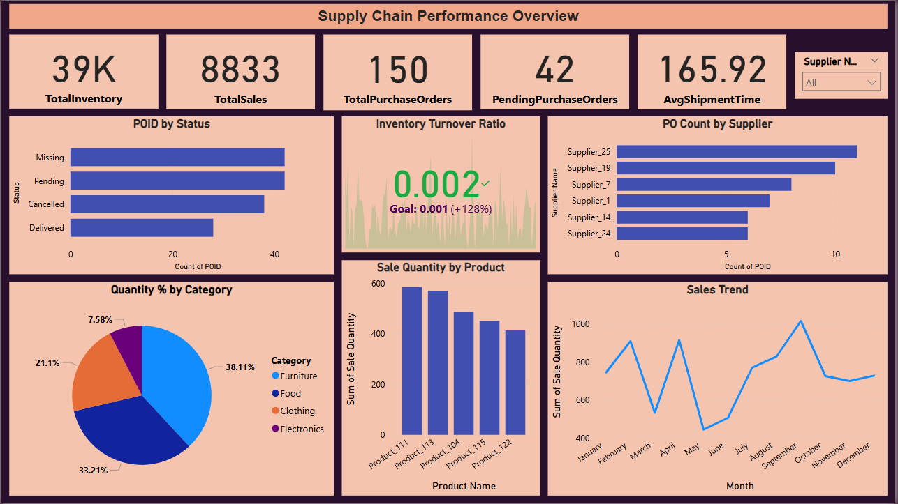

# Supply_Chain_Performance_Overview (Power BI Dashboard)
This Power BI dashboard provides a comprehensive analysis of supply chain performance metrics using key datasets such as Inventory, Sales, Purchase Orders, Suppliers, and Shipments.

## Dashboard Overview
The report tracks and visualizes KPIs like:
- Inventory Turnover Ratio
- Stock Levels
- Purchase Order Status
- Supplier Performance
- Sales by Region/Product
- Shipment Fulfillment

## Tools Used
- Power BI
- DAX (for KPIs and calculations)

## File Structure
- `Supply Chain Performance Overview.pbit`: Power BI Template
- `project_description.md`: Detailed analysis write-up
- `images/`: Include screenshots of visuals and KPI cards

##  Insights & Analysis
See [project_description.md](./project_description.md) for full report on insights, recommendations, and DAX logic.

---

## Preview

---

## Author
Praful Patel  
Master's in Computer Science | Data Analytics Enthusiast
Contact: [praful94ca@gmail.com]  

